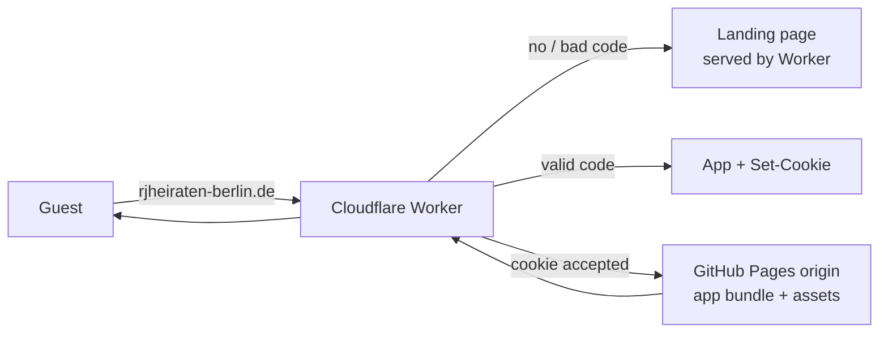

# wedding

Raquel & Jean-Paul — private wedding invitation website. A static single-page
app (Vite + React) on GitHub Pages, gated behind a Cloudflare Worker that serves
a landing page until a valid guest magic link is presented.

## What a guest sees

- **No link / wrong code** → a locked landing page (hero image, date, and an
  "Invitation code" field). The app itself is never loaded.
- **Valid code** (`?t=<token>` or entered in the field) → the Worker sets a
  60‑day `HttpOnly` cookie and proxies the app from GitHub Pages.
- **`vows` invitation** → full site: ceremony, brunch, and the party.
- **`party` invitation** → celebration section only (party card, RSVP, gallery,
  optional day, hotels).
- Tokens **never expire** and are signed with HMAC‑SHA256 using a secret stored
  only as the Worker's `TOKEN_SECRET` (never in the bundle).

## Architecture



- The Worker is the only public entry point and decides to serve the landing
  page or proxy the app. Unauthenticated HTML requests never reach GitHub Pages;
  gated assets return `404` to unauthenticated clients.
- The Worker overwrites the `Host` header with the visitor's custom domain so
  GitHub Pages serves the right project, injects `wedding:variant` /
  `wedding:name` meta tags into `</head>`, and forces `Cache-Control: no-store`.
- Only `hero.jpg`, favicon, and `robots.txt` are served without a token.

### Why the site can still appear at `https://jeanpauledoh.github.io/wedding/`

A Worker cannot "unpublish" the origin. The default branch is public, so the
built site remains downloadable there. Mitigation (all in place):
`noindex` robots meta, and the app renders a **blocked gate** (not the site)
whenever it boots on a non‑localhost origin without the Worker's meta tags.
Anyone pulling the raw assets could still reconstruct the content — if that is
unacceptable, make the repo private.

## Repository layout

```
worker/            Cloudflare Worker (gate + landing page)
  src/index.ts     request handling, token verification, proxying
  src/landing.ts   self-contained landing page (de/fr/en)
  wrangler.toml    Worker config
scripts/           offline guest/token tooling (Node, no deps)
  gen-tokens.mjs   mint tokens from resources/guests.csv
  gen-qr.mjs       SVG/PNG QR codes + printable sheet from tokens
  verify-token.mjs validate generated links
  lib/token.mjs    signing/parsing (base64url + HMAC-SHA256)
  lib/env.mjs      env + CSV helpers
resources/
  guests-example.csv  template for your real guest list
  guests.csv          REAL guest list — gitignored, never commit
resources/qr/      generated tokens/QR codes — gitignored
src/               the app: GuestContext reads the injected meta tags
```

## Local development

```bash
npm install
npm run dev              # http://localhost:5173
```

Locally there is no Worker, so everyone gets the **vows** (full) site by
default. To preview the party layout:

```bash
npm run dev
open "http://localhost:5173/?variant=party"   # localhost only
```

## Guest tokens & QR codes

1. Create `.env.local` (gitignored) and set the secrets — see `.env.example`:

   ```bash
   TOKEN_SECRET=<openssl rand -hex 32>
   VITE_SITE_URL=https://rjheiraten-berlin.de
   ```
2. `cp resources/guests-example.csv resources/guests.csv`, then fill in real
   guests (columns: `name,variant,lang`; variant = `vows` | `party`, lang =
   `de` | `fr` | `en`).
3. Mint links & QR codes and sanity-check:

   ```bash
   npm run gen:tokens       # resources/qr/tokens.csv + manifest.json
   npm run gen:qr           # resources/qr/<slug>.svg .png + sheet.html
   npm run verify-token     # validates every minted link
   ```

   Print `resources/qr/sheet.html` for printable invitations. The invite link
   is `https://rjheiraten-berlin.de/?t=<token>`.

> ⚠️ Everything minted ends up inside `resources/` which is gitignored. Make
> the repo private if you want the source + tooling out of sight too.

## Production build

```bash
npm run build              # outputs to dist/
npm run preview            # serve the production build locally
```

## Test the gate locally

Run the app as the "origin" and the Worker in front of it, so you can exercise
the whole flow (landing page → access code → cookie → proxied app) without the
live GitHub Pages origin.

**Terminal 1 — serve the built app as the origin:**

```bash
npm run build
npm run preview            # http://localhost:4173
```

**Terminal 2 — run the Worker in front of it** (secret = same value as your
`.env.local`; `ORIGIN` points the Worker at your local preview instead of the
GitHub Pages origin):

```bash
# From the repo root:
TOKEN_SECRET=<your secret> npm run worker:dev \
  -- --var ORIGIN:http://localhost:4173     # http://localhost:8787
```

> `ORIGIN` is a local-only override — it is omitted in production
> (`wrangler.toml`/CI default to the GitHub Pages origin).
>
> Alternative: run `wrangler dev` from inside `worker/` (config is discovered
> automatically) and keep non-public vars in `worker/.dev.vars` instead:
> `TOKEN_SECRET=<your secret>`, `ORIGIN=http://localhost:4173`.

**Check the matrix while the Worker is running:**

| Request | Expected |
|---|---|
| `http://localhost:8787/` | landing gate with code field |
| `http://localhost:8787/?t=<minted token>` | 302 redirect, `Set-Cookie`, then the full/party site with `wedding:variant` meta injected (no `?t=` in the URL) |
| `http://localhost:8787/?t=<wrong or tampered code>` | landing gate with the "invalid" error shown |
| `http://localhost:8787/assets/…` without a cookie | `404` |
| `http://localhost:8787/hero.jpg`, `/robots.txt` | `200` without a token (public allow-list) |

Worker compile check without deploying:

```bash
npm run deploy:worker -- --dry-run
```

## Deployment & the manual checklist

Pushing to `main` runs `.github/workflows/deploy.yml`: it builds the app for
GitHub Pages, uploads the artifact, **and** deploys + secret‑sets the Worker.
The workflow needs three repo secrets: `VITE_SITE_URL`, `TOKEN_SECRET`,
`CLOUDFLARE_API_TOKEN`, `CLOUDFLARE_ACCOUNT_ID`.
(See the worker code for where `VITE_SITE_URL` is used by the app.)

Follow this order — the route must exist **before** DNS flips to Proxied,
otherwise visitors hit GitHub Pages directly (ungated).

| # | You do this | Done |
|---|---|---|
| 1 | Cloudflare → **Workers & Pages** → Create application → upload `worker/wrangler.toml` (or run `npm run deploy:worker` once you're logged in with `wrangler login`). | ☐ |
| 2 | Set the Worker secret: `npx wrangler secret put TOKEN_SECRET` (same value as your repo secret; the deploy job also (re)sets it on every push). | ☐ |
| 3 | Worker → **Settings → Triggers → Custom domains**: add `rjheiraten-berlin.de` (**Worker route first!**). | ☐ |
| 4 | Cloudflare DNS → add/edit the record for **rjheiraten-berlin.de** to Proxy mode (orange cloud). The worker then serves `https://` for the domain. | ☐ |
| 5 | Verify in a private window: `https://rjheiraten-berlin.de/` shows the gate; open a minted `?t=` link → full/party site; wrong code → error on the gate. | ☐ |

> Steps 1–4 only happen once; every site change after that is just `git push`.
> Add `secrets.CLOUDFLARE_API_TOKEN` and `secrets.CLOUDFLARE_ACCOUNT_ID` to
> GitHub **Settings → Secrets → Actions** before the first `deploy-worker` run.

## Known trade-offs

- Assets remain downloadable from the public GitHub Pages origin while the
  repo is public (mitigated, not eliminated — see above).
- The token/cookie mechanism is not "security"; treat it as an access gate
  (a valid HMAC token is unforgeable without the secret, but the secret never
  leaves the Worker, and links can be shared like any invitation).