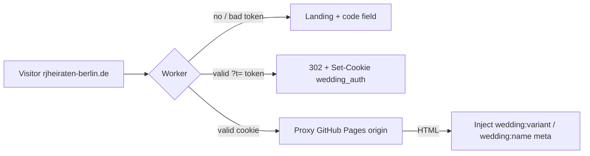

# Guest Invitation Gating — Magic Links, Variants & the Cloudflare Worker

## Goal
Private wedding site for two guest groups, no account system:
- `vows`  → ceremony + brunch + party (full site)
- `party` → the celebration only (party card, RSVP, gallery, optional day, hotels)

Access is enforced at the **edge** (Cloudflare Worker in front of GitHub Pages),
not just client-side. A visitor with no valid code sees a landing page served by
the Worker and never downloads the app bundle.

## Approved architecture



- Origin stays GitHub Pages (free). Worker = free plan, 100k req/day.
- The Worker is the only public origin; unauth'd HTML never hits Pages, and
  a valid token yields a clean `/` (search param stripped) plus an `HttpOnly`
  `SameSite=Lax` cookie (60 days).
- Public/no-token allow-list: `hero.jpg`, favicon, `robots.txt` only.
- Gated non-HTML paths without a cookie → `404`.
- Origin requests: `Host` header set to the visitor's host (custom domain),
  cookies stripped, 3xx forwarded as-is so the gate stays in front.
- Local testing uses `?variant=vows|party` (localhost only); default `vows`.
- `github.io` origin leak is mitigated (noindex + a client-side "blocked"
  state when the meta tags are absent), not eliminated.

## Token spec (`scripts/lib/token.mjs` + `worker/src/index.ts`)
- Payload: `base64url(JSON { v, n })`; signature: full 32‑byte
  `hex(HMAC-SHA256(secret, payload))`, constant-time compared.
- `v ∈ {vows, party}`, `n ≤ 40 chars`. Tokens **never expire** — the site stays
  usable as a memory after the wedding.
- The secret exists only as the Worker's `TOKEN_SECRET` and in `.env.local` —
  never compiled into the site.

## How the app learns the guest
The Worker injects into the proxied HTML's `</head>`:
```html
<meta name="wedding:variant" content="vows|party">
<meta name="wedding:name" content="...">
```
`src/lib/guest.ts` + `src/context/GuestContext.tsx` read those meta tags and
resolve one of three states:
- `vows` / `party` → render the matching site (`Details.tsx` hides the
  ceremony + brunch cards for `party`, uses single-card layout + party copy).
- `blocked` (no meta, not localhost) → `src/components/Blocked.tsx`: full-screen
  gate with the code field, disabled with a hint if `VITE_SITE_URL` is unset.

## Behavior matrix
| Situation | Result |
|---|---|
| `rjheiraten-berlin.de/` no code | Worker landing page, code field |
| `?t=` valid `vows` | 302, cookie, full site + `wedding:variant=vows` |
| `?t=` valid `party` | 302, cookie, celebration-only site |
| `?t=` invalid / tampered | landing page with the "wrong code" error shown |
| cookie set | app proxied, meta injected, `Cache-Control: no-store` |
| `github.io/wedding/` (leak) | app boots → `blocked` gate with code field |
| gated asset without cookie | `404` |

## Tooling (`npm run gen:tokens`, `gen:qr`, `verify-token`)
1. `.env.local`: `TOKEN_SECRET` + `VITE_SITE_URL`.
2. `resources/guests.csv` (gitignored) — `name,variant,lang`.
3. Tokens → CSV + `manifest.json`; QR → SVG/PNG + printable `sheet.html`.
4. Verify round-trips every minted link.

## Verification
- `npm run typecheck && npm run build`.
- `npx wrangler dev --config worker/wrangler.toml` matrix: landing, vows,
  party, invalid/tampered, cookie follow-through, public asset
  pass-through, gated-asset `404`, meta injection for proxied HTML.
- After deploy: repeat step 5 of the README checklist in a private window.

## Non-goals / limits
- Not real security: minted links and the cookie are shareable like any paper
  invite; the repo staying public keeps the raw origin assets downloadable.
- No token rotation/revocation; tokens are intentionally permanent so the site
  stays accessible as a memory after the wedding.